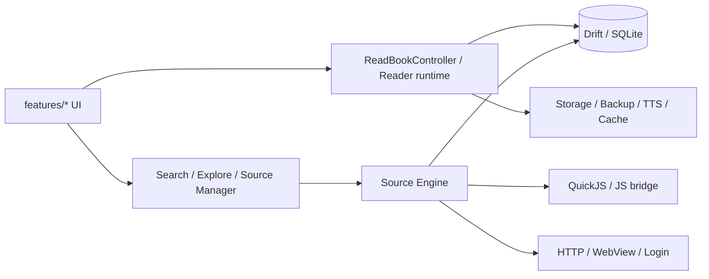

<p align="center">
  
</p>

<p align="center">
  <strong>墨頁（Inkpage）</strong> 是一個以中文閱讀體驗為核心的 Flutter 小說閱讀器。<br>
  它延伸自 Legado 的書源能力，但目標不是做一個 Android-only 的功能集合，
  而是做出一個 <strong>可建置、可側載、可長期維護、可持續發版</strong> 的閱讀器本體。
</p>

<p align="center">
  <a href="https://github.com/bennytsai1234/reader/releases/tag/v0.2.10"></a>
  <a href="https://github.com/bennytsai1234/reader/actions/workflows/dart.yml"></a>
  
  
  
</p>

<p align="center">
  <a href="https://github.com/bennytsai1234/reader/releases">下載 Release</a>
  ·
  <a href="docs/README.md">文檔索引</a>
  ·
  <a href="docs/roadmap.md">路線圖</a>
  ·
  <a href="CONTRIBUTING.md">貢獻指南</a>
  ·
  <a href="CHANGELOG.md">變更記錄</a>
</p>

---

## 專案定位

墨頁不是單純的 Flutter UI 殼。它現在是一個完整的閱讀器系統，由四條主線組成：

- **閱讀器 runtime**：`ReadBookController` 負責進度、還原、翻頁、TTS follow 與章節生命週期。
- **書源引擎**：`lib/core/engine/` 提供 URL 分析、規則解析、JS bridge、WebView 書源與登入流程。
- **資料層**：Drift (SQLite) + DAO 保存書架、章節、偏好、書源與下載資料。
- **產品模組**：書架、搜尋、探索、書源管理、閱讀器、設定、本地書、備份還原。

如果要一句話描述它：

> **Inkpage = 中文閱讀器體驗 + Legado 書源能力 + Flutter 可維護架構。**

## 為什麼是 Inkpage

| 面向 | Inkpage 的做法 |
| --- | --- |
| 產品目標 | 專注在小說閱讀器本體，不做 RSS、影音聚合、泛內容容器 |
| 技術方向 | 以 `legado` 作為 compatibility spec，而不是直接把 Android runtime 整包搬進 Flutter |
| 執行期策略 | 書源可用性、隔離、建議清理、閱讀失敗換源，已接進 app 主流程 |
| 發版能力 | 有 GitHub Actions、固定 Android release signing、release notes 與版本節奏 |
| 長期維護 | 文檔、測試、資料層、reader runtime、source engine 都已拆成可持續整理的模組 |

## 目前狀態

| 項目 | 狀態 |
| --- | --- |
| 最新版本 | `v0.2.10` |
| 目前主線 | `main` |
| 資料庫 schema | `v8` |
| Dart SDK | `^3.7.0` |
| 目前主焦點 | 打磨既有能力，不再盲目擴張新功能 |

`v0.2.10` 之後，專案的重心不是再追求更多功能，而是把現有能力做穩：

- 閱讀器 runtime
- 書源引擎可預測性
- 書源健康狀態與隔離策略
- 測試環境可信度
- 發版流程與升級路徑

## 功能總覽

### 閱讀器

- 平移 / 捲動兩種閱讀模式
- 閱讀進度保存與還原
- 書籍詳情、章節列表、目錄與正文整鏈閱讀
- TTS 朗讀、章節跟隨、自動翻頁
- 閱讀失敗時的自動換源 / 手動換源

### 書源能力

- 全部 / 分類 / 單一書源搜尋
- 發現頁（雙層分類、JS 規則、快取回退）
- 書源登入、WebView 書源、規則 JS 擴充
- 書源校驗、失效隔離、建議清理
- 純小說策略：非小說 / 下載站 / 登錄牆來源可直接排除或清理

### 本地與資料

- TXT / EPUB / UMD 匯入
- 書架管理、分組、書籍詳情
- 本地備份 / 還原
- 書架匯入匯出
- 下載、分享導入與基礎平台整合

## 架構概覽



核心入口：

- 啟動：`lib/main.dart`
- 依賴注入：`lib/core/di/injection.dart`
- 資料庫：`lib/core/database/app_database.dart`
- 閱讀器主控：`lib/features/reader/runtime/read_book_controller.dart`
- 書源引擎：`lib/core/engine/`

## 專案結構

```text
lib/
  core/         資料層、書源引擎、網路、服務、儲存與工具
  features/     產品功能模組（閱讀器、搜尋、探索、書源管理…）
  shared/       共用主題與 widgets
docs/           設計、架構、roadmap 與交接文檔
test/           單元與整合測試
tool/           source validation、QuickJS wrapper、工具腳本
release-notes/  每次 release 的版本說明
```

## 下載

- **Android APK**：到 [GitHub Releases](https://github.com/bennytsai1234/reader/releases) 下載
- **iOS**：release workflow 會附未簽名 IPA，適合自行簽名或用 AltStore 側載

`v0.2.8` 開始，Android release 會使用固定正式 keystore 簽名。  
如果裝置上仍安裝的是更早期的 debug-signed APK，升級到這一版可能需要最後一次手動卸載重裝；之後版本應可正常覆蓋安裝。

## 快速開始

### 作為使用者

1. 從 [Releases](https://github.com/bennytsai1234/reader/releases) 下載最新版 APK
2. 安裝後匯入你自己的小說書源
3. 進入搜尋或發現頁，開始加入書架並閱讀

> 本專案只提供閱讀器程式本體，不提供任何書籍內容或站點資料。

### 作為開發者

環境需求：

- Flutter SDK（建議 `stable` channel）
- Dart `^3.7.0`
- Android Studio / Xcode 對應本機平台

常用命令：

```bash
flutter pub get
flutter pub run build_runner build --delete-conflicting-outputs
flutter analyze
tool/flutter_test_with_quickjs.sh
flutter test test/features/reader/read_book_controller_test.dart
flutter run
flutter build apk --release
flutter build ios --release --no-codesign
```

如果修改了這些位置，記得先重新生成 Drift 程式碼：

- `lib/core/database/tables/`
- `lib/core/database/app_database.dart`
- 任何 Drift DAO 定義

## 測試與驗證

目前 repo 有 **89 個測試檔**，覆蓋：

- 閱讀器 runtime：restore、progress、navigation、scroll/slide、TTS
- 書源引擎：parser、AnalyzeUrl、JS extensions、Promise bridge、integration
- 本地書解析、備份、下載與工具服務

Linux / WSL / CI 下要注意：

- `flutter test` 需要 `flutter_js` 的 `libquickjs_c_bridge_plugin.so`
- repo 已提供 `tool/flutter_test_with_quickjs.sh`
- source validation 也請走 repo 內的腳本，例如 `tool/run_source_validation.sh`

提交前的最低建議：

```bash
flutter analyze
tool/flutter_test_with_quickjs.sh
```

## 發版流程

1. 撰寫 `release-notes/vX.Y.Z.md`
2. 更新 `pubspec.yaml` 版本
3. 跑 `flutter analyze` 與對應測試
4. `git commit`、`git tag vX.Y.Z`
5. `git push && git push --tags`

GitHub Actions 會自動產生 release build。  
現在 Android release workflow 已支援固定 keystore signing，不再每次換簽名。

## 文檔

- [docs/README.md](docs/README.md) — 文檔索引與閱讀順序
- [docs/architecture.md](docs/architecture.md) — 專案目標架構與邊界
- [docs/reader_architecture_current.md](docs/reader_architecture_current.md) — 閱讀器 runtime 現況
- [docs/DATABASE.md](docs/DATABASE.md) — Drift schema、DAO、migration
- [docs/roadmap.md](docs/roadmap.md) — 目前主線、不做清單與下一階段重點
- [docs/next_stage_handoff.md](docs/next_stage_handoff.md) — 下一階段交接與風險
- [docs/source_audit_backlog.md](docs/source_audit_backlog.md) — 與 `legado` 的手動對照紀錄

## 貢獻與社群

- [CONTRIBUTING.md](CONTRIBUTING.md) — 開發與提交約定
- [CODE_OF_CONDUCT.md](CODE_OF_CONDUCT.md) — 行為準則
- [SECURITY.md](SECURITY.md) — 安全回報方式

如果你要提 issue，最有幫助的資訊通常是：

- 裝置 / 系統版本
- 書源名稱與觸發階段（搜尋 / 詳情 / 目錄 / 正文 / 發現）
- 是否為 JS / WebView 書源
- 可重現步驟
- 錯誤訊息或截圖

## 授權與使用說明

本專案採用 [Apache License 2.0](LICENSE)。

墨頁只提供閱讀器程式本體，不提供任何小說內容、站點資料或書源服務。  
請自行確認匯入、抓取、側載、分享與使用行為符合所在地法律、站點條款與平台規範。
