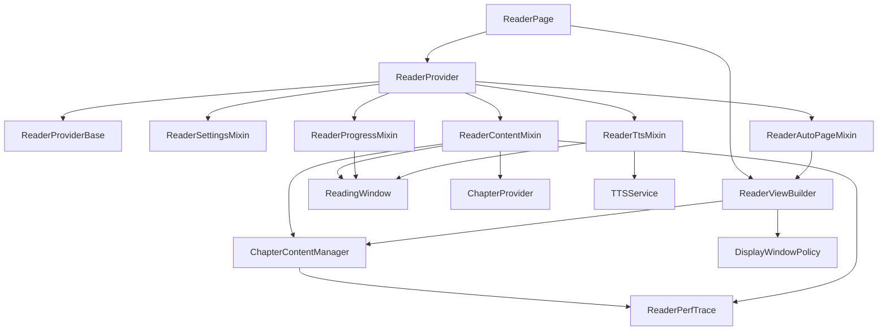

# Reader Architecture Roadmap

## Module Diagram

## Current Responsibilities

- `ReaderProvider`: bootstraps the reader session and wires all mixins together.
- `ReaderContentMixin`: coordinates chapter loading, window rebuild, staged preload, and content processing.
- `ChapterContentManager`: owns fetch, pagination cache, preload queue, and eviction.
- `ReadingWindow`: pure assembly and offset lookup layer for merged chapter pages.
- `ReaderProgressMixin`: restore, jump, and progress persistence.
- `ReaderTtsMixin`: TTS state machine, chapter boundary handoff, and highlight sync.
- `ReaderViewBuilder`: renders page/scroll mode and bridges scroll events back into provider state.

## Priority Roadmap

### P0 Stabilize runtime transitions

- Keep programmatic scroll and user scroll separate.
- Make scroll mode use a stable displayed chapter range that only expands at the edges.
- Stage startup preload so the current chapter renders before the full 5-chapter window warms up.

### P1 Improve observability

- Add lightweight timing probes around fetch, processing, and pagination.
- Use the traces to find whether startup cost is dominated by I/O, content processing, or layout.

### P1 Reduce repeated scanning

- Precompute paragraph/highlight indexes for TTS lookup instead of scanning merged pages on every progress update.
- Store more page metadata during pagination to avoid repeated per-page first/last line discovery.

### P2 Separate state domains further

- Extract a dedicated reading-position controller from `ReaderProgressMixin`.
- Move TTS text preparation into an engine-side session builder.
- Replace ad-hoc provider/UI handshakes with small coordinator classes where behavior is temporal.

## Implemented In This Pass

- Added staged startup warmup: render current chapter first, expand the window shortly after restore.
- Added `ReaderPerfTrace` hooks around chapter fetch, content processing, and pagination.
- Rebuilt scroll-mode chapter merge around a stable displayed range plus edge-driven preload.
- Kept compatibility with the current provider/mixin structure and existing tests.
